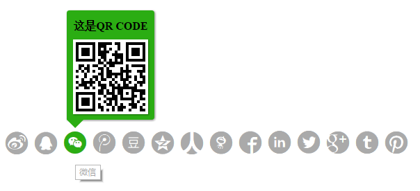

# iShare.js

##### **iShare.js**是一个小巧的分享插件，纯JS编写，不依赖任何第三方库，使用简便。

目前国内比较受欢迎的分享插件，都集成了很多常用的分享接口，功能都很丰富。不过个人体验后，总结如下不足（个人观点）：

1. 定制度不高，特别在自定义样式上╮(╯﹏╰)╭。
2. 没有更新维护，部分接口都是挂掉的。
3. 提供的大部分接口都是没有用到，而真正用到就那么几个，显得有点冗余。

**iShare.js**是针对上述问题而诞生的，并为自定义样式的创建方式定制了专门的精简版：iShare_tidy



## 安装

`npm install iShare` 或 `or bower install iShare`

## Features

- 支持UMD模式（AMD，CMD, Globals）
- 纯js编写，不依赖任何库
- 多种配置方式
- 兼容性好
- 支持常用的分享接口

## 支持分享接口

- QQ好友
- QQ空间
- 腾讯微博
- 新浪微博
- 微信
- 豆瓣
- 人人
- 有道笔记
- Linkedin
- Facebook
- Twitter
- Google+
- Pinterest
- Tumblr

## 配置项

```js
container: '.iShare1',
config:
	{
		title: 'title',
		description: 'description',
		url: 'url',
        img: 'imgurl'，
        description: 'description',
        sites: ['iShare_weibo','iShare_qq','iShare_wechat','iShare_tencent','iShare_douban','iShare_qzone','iShare_renren','iShare_youdaonote','iShare_facebook','iShare_linkedin','iShare_twitter','iShare_googleplus','iShare_tumblr','iShare_pinterest'],
		initialized: true,
		isAbroad: false,
		isTitle: true,
		WXoptions:{
			evenType: 'click',
			isTitleVisibility: true,
			title: '二维码标题',
			isTipVisibility: true,
			tip: '二维码描述文本',
			bgcolor: '#2BAD13'
		}
	}
```
- **container**: 分享容器节点,仅支持`'class'`和`'id'`两种选择模式。 `'class'`模式:` '.class'`; `'id'`模式: `'#id'`.
- **config**:
    - **title**：分享标题. 默认: `document.title`
    - **url**：分享的URL. 默认：`location.href`
    - **description**：分享的**summary**或**description**，默认为meta的description
    - **image**：指定分享图片的**src**，默认为页面第一图片
    - **sites**：指定使用那些分享接口
    - **initialized**：自动创建必须开启字段. `isAbroad`，`isTitle`才能生效.默认开启
    - **isTitle**：如果为`true`,会开启a标签的`title`属性, 默认是为`false`
    - **isAbroad**：
    	- 默认`undefined`，开启国外分享接口 + 国内分享接口.
		- 为true时，开启国外分享接口:
		`'iShare_facebook'`,`'iShare_linkedin'`,`'iShare_twitter'`,`'iShare_googleplus'`,`'iShare_tumblr'`,`'iShare_pinterest'`.
		- 为false时，开启国内分享接口：
		`'iShare_weibo'`,`'iShare_qq'`,`'iShare_wechat'`,`'iShare_tencent'`,`'iShare_douban'`,`'iShare_qzone'`,`'iShare_renren'`,`'iShare_youdaonote'`.
	- **WXoptions**：
        - evenType：微信二维码的触发方式，仅支持:`'click'`和`'mouseover'`，默认为`'mouseover'`.
        - isTitleVisibility：是否显示二维码标题，默认为显示，即为`true`.
        - title：二维码标题.
        - isTipVisibility：是否显示二维码描述信息，默认为显示，即为`true`.
        - tip：二维码描述文本
        - bgcolor：二维码的背景颜色

## 使用
##### 支持两种初始化方式：
- 单例模式
- 实例化模式

> <font color="red">注意：不要同时使用两种模式</font>

#### 单例模式
> <font color="#E91E63">本实例展示了自定义样式分享的创建过程。另外本库针对自定义样式的创建提炼出一个精简版本：iShare_tidy版本</font>

```xml
// 引入脚本文件
<script type="text/javascript" src="iShare_tidy.js"></script>
```

```xml
// 引入HTML脚本
<div class="iShare iShare1">
	<a href="#" class="iShare_qzone"><i class="iconfont qzone">&#xe610;</i></a>
	<a href="#" class="iShare_tencent"><i class="iconfont tencent" style="vertical-align: -2px;">&#xe608;</i></a>
	<a href="#" class="iShare_weibo"><i class="iconfont weibo">&#xe609;</i></a>
	<a href="#" class="iShare_wechat"><i class="iconfont wechat" style="vertical-align: -2px;">&#xe613;</i></a>
	<a href="#" class="iShare_facebook"><i class="iconfont facebook" style="vertical-align: 1px;">&#xe601;</i></a>
	<a href="#" class="iShare_googleplus"><i class="iconfont googleplus" style="vertical-align: -1px;">&#xe60b;</i></a>
	<a href="#" class="iShare_linkedin"><i class="iconfont linkedin" style="vertical-align: 2px;">&#xe607;</i></a>
	<a href="#">我是酱油一号</a>
	<a href="#">我是酱油二号</a>
</div>
//子元素需要指定如下的类名：
//iShare_qq         : 'QQ好友',
//iShare_qzone      : 'QQ空间',
//iShare_tencent    : '腾讯微博',
//iShare_weibo      : '新浪微博',
//iShare_wechat     : '微信',
//iShare_douban     : '豆瓣',
//iShare_renren			: '人人',
//iShare_youdaonote : '有道笔记',
//iShare_linkedin   : 'Linkedin',
//iShare_facebook   : 'Facebook',
//iShare_twitter    : 'Twitter',
//iShare_googleplus : 'Google+',
//iShare_pinterest	: 'Pinterest',
//iShare_tumblr			: 'Tumblr'
//插件会根据类名自动处理，如果存在不包含上述类名的子元素，该元素就不作任何处理。
```

```xml
// 配置全局变量iShare_config
<script type="text/javascript">
iShare_config = {container:'.iShare1',config:{
		title: '分享标题',
		description: '这是分享描述文本',
		url: 'https://github.com/zhansingsong',
		WXoptions:{
			evenType: 'click',
			isTitleVisibility: true,
			title: '二维码标题',
			isTipVisibility: true,
			tip: '二维码描述文本',
			bgcolor: '#2BAD13',
		}
	}};
</script>
```

#### 实例化模式
```xml
// 引入样式文件(自定义样式可以不用引入)
<link rel="stylesheet" type="text/css" href="./style/fonts/iconfont.css">
<link rel="stylesheet" type="text/css" href="./style/css/ishare.css">
```
```xml
// 引入脚本文件
<script href="javascript:;" type="text/javascript" src="iShare.js"></script>
```
```xml
// 引入HTML脚本
<div class="iShare iShare-16 iShareClassName"></div> // 容器类名选择器: "iShareClassName"
```

```xml
// 实例化对象
<script type="text/javascript">
	(new iShare({container:'.iShare1',config:{
		title: '分享标题',
		description: '这是分享描述文本',
		url: 'https://github.com/zhansingsong',
		isAbroad: false,
		isTitle: true,
		initialized: true,
		WXoptions:{
			evenType: 'click',
			isTitleVisibility: true,
			title: '二维码标题',
			isTipVisibility: true,
			tip: '二维码描述文本',
			bgcolor: '#2BAD13',
		}
	}}));
</script>
```

## 更多详情请参考DEMO
- [iShare版本](http://zhansingsong.github.io/demo/iShare.html)
- [iShare_tidy版本](http://zhansingsong.github.io/demo/iShare_tidy.html)

## License
iShare.js is covered by the MIT License.


